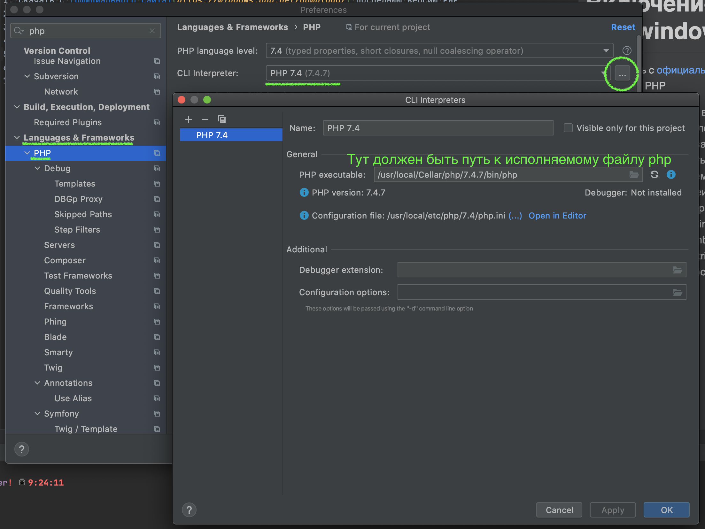

# Установка php для windows
1. Скачать с [официального сайта](https://windows.php.net/download/) последнюю версию PHP
1. Распаковать архив в корень диска `С`, либо в любой другой каталог. 
1. Каталог с распакованными файлами желательно назвать `php`.
1. Найти в получившемся каталоге файл `php.ini-development` и переименовать его в `php.ini`.
1. Прописать путь (скорее всего это будет `c:\php\bin\php`) до исполняемого файла php в phpstorm.
  
1. Прописать путь до PHP в переменные среды. Подробнее -  https://www.php.net/manual/ru/faq.installation.php#faq.installation.addtopath 

- Как это сделать в windows10 - https://www.youtube.com/watch?v=mqIgUbpSz_A 

Так же можно воспользоваться готовым "комбайном" [XAMPP](https://www.apachefriends.org/ru/download.html). 

# Включение mbstring для windows
1. Открыть файл php.ini в текстовом редакторе и заменить строку `;extension=mbstring` 
   строкой `extension=php_mbstring.dll`
   
   
